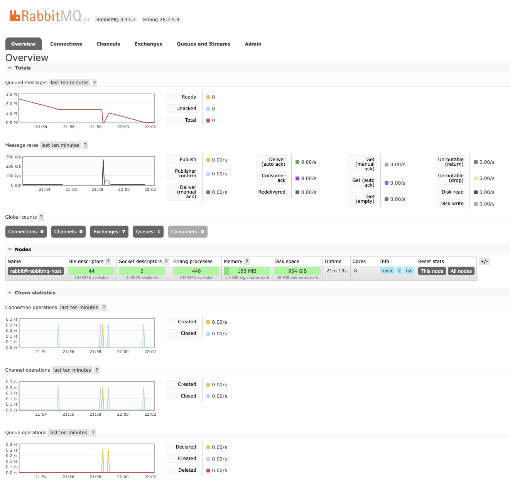
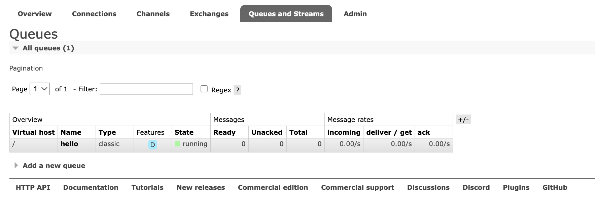
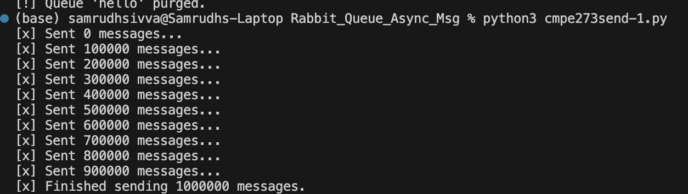
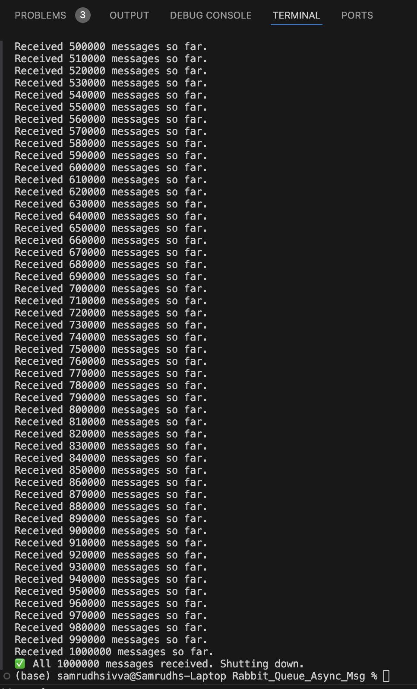

# 📨 CMPE 273 - Asynchronous Messaging with RabbitMQ

## 📌 Objective

Demonstrate **asynchronous messaging** using **RabbitMQ** by implementing a **producer-consumer** model. The producer sends **1,000,000 messages** to a queue, and the consumer receives and processes all messages without data loss, ensuring decoupled and event-driven communication.

---

## 📁 Project Files

- `cmpe273send-1.py` → Producer script (sends 1,000,000 messages)
- `cmpe273receive-1.py` → Consumer script (receives messages and exits at 1,000,000)
- `reset.py` → Optional queue purge script (clears old messages from the queue)

---

## 🛠️ Requirements

- Python 3.x
- RabbitMQ
- Python `pika` library

Install pika with:

```bash
pip install pika


🚀 Run RabbitMQ with Docker (Recommended)

Use Docker to run RabbitMQ locally:

docker run -d --hostname rabbitmq-host --name rabbitmq \
  -p 5672:5672 -p 15672:15672 rabbitmq:3-management

Access the RabbitMQ UI at: http://localhost:15672
Default login:
Username: guest
Password: guest


⚙️ How to Run

🔁 Step 1: Purge the Queue (Recommended)
This clears any previous messages in the queue:

python3 reset.py
📤 Step 2: Run the Producer
This sends exactly 1,000,000 messages to the queue:

python3 cmpe273send-1.py
Expected output:

[x] Finished sending 1000000 messages.
📥 Step 3: Run the Consumer
This will consume exactly 1,000,000 messages and stop:

python3 cmpe273receive-1.py
Expected output (sample):

Received 10000 messages so far.
...
✅ All 1000000 messages received. Shutting down.
✅ Features

Durable Queue: Messages are persistent and survive RabbitMQ restarts.
Progress Logging: Consumer logs progress every 10,000 messages.
Clean Shutdown: Consumer stops automatically after receiving 1,000,000 messages.
Queue Purging: reset.py ensures test consistency by cleaning old messages.


### 🖼️ Relevant Screenshots

#### 1. RabbitMQ Management Dashboard


#### 2. Queue Purged via reset.py


#### 3. Producer Sending Messages


#### 4. Consumer Receiving and Completing 1,000,000 Messages

